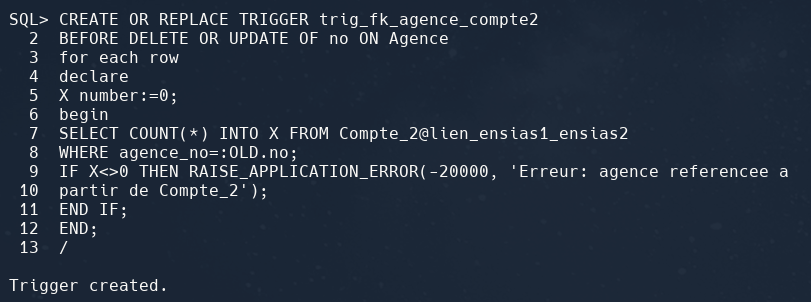

# 💻 TP1 – Répartition des données

**Nom & Prénom : Abderrahmane ESSAHIH**  
**Filière : GL – ENSIAS**

---

## 🔗 Étape 0 : Connexion et Ping des Serveurs


### ➤ Test de connexion entre serveurs (Ping)

```bash
ping 10.23.15.229
```


---

### ➤ Connexion aux serveurs Oracle

```bash
sqlplus c##essahih/essahih@ensias1
```

### ➤ Création des tables de la base de donnée


---

## 1. 📂 Répartition des données : Définition des fragments

### a. Fragmentation horizontale – Table `Client`

#### Sur Serveur1 (Casablanca)

```sql
COPY FROM c##essahih/essahih@ensias1 TO c##essahih/essahih@ensias1 APPEND Client_1 USING SELECT NO, NOM, PRENOM, ADRESSE FROM Client WHERE Ville = 'Casablanca';

```


#### Sur Serveur2 (Rabat)

```sql
COPY FROM c##essahih/essahih@ensias2 TO c##essahih/essahih@ensias2 APPEND Client_2 USING SELECT NO, NOM, PRENOM, ADRESSE FROM Client WHERE Ville = 'Rabat';

```


### b. Fragmentation horizontale pour la table Compte :

#### Sur Serveur1 (Casablanca)

```sql
CREATE TABLE Compte_1 AS SELECT * FROM Compte WHERE CLIENT_NO IN ( SELECT NO FROM Client WHERE VILLE = 'Casablanca');

```


#### Sur Serveur2 (Rabat)

```sql
COPY FROM c##essahih/essahih@ensias1 TO c##essahih/essahih@ensias2 REPLACE Compte_2 USING SELECT * FROM Compte WHERE client_no IN ( SELECT no FROM Client WHERE ville = 'Rabat');

```


### c. Fragmentation horizontale pour la table Operation :


#### Sur Serveur1 (Casablanca)

```sql
CREATE TABLE Operation_1 AS SELECT * FROM Operation WHERE compte_no IN ( SELECT no FROM Compte_1 );

```


### c. Fragmentation horizontale pour la table Operation :


#### Sur Serveur1 (Casablanca)

```sql
CREATE TABLE Operation_1 AS SELECT * FROM Operation WHERE compte_no IN ( SELECT no FROM Compte_1 );

```


#### Sur Serveur2 (Rabat)

```sql
COPY FROM c##essahih/essahih@ensias1 TO c##essahih/essahih@ensias2 REPLACE Operation_2 USING SELECT * FROM Operation WHERE compte_no NOT IN ( SELECT no FROM Client_1 );

```


#### Sur Serveur2 (Rabat)

```sql
COPY FROM c##oumghar/oumghar@ensias1 TO c##oumghar/oumghar@ensias2 REPLACE Operation_2 USING SELECT * FROM Operation WHERE compte_no NOT IN ( SELECT no FROM Client_1 );

```


### d. Déplacement complet de la table Type_Compte sur Serveur2 : Type_Compte_2

```sql
COPY FROM c##essahih/essahih@ensias1 TO c##essahih/essahih@ensias2 REPLACE Type_Compte_2 USING SELECT * FROM Type_Compte;
```


### e. Déplacement complet de la table Type_Operation sur Serveur2 : Type_Operation_2


```sql
COPY FROM c##essahih/essahih@ensias1 TO c##essahih/essahih@ensias2 REPLACE Type_Operation_2 USING SELECT * FROM Type_Operation;
```


### f. Les Séquences restent sur Serveur1.


```sql
desc user_objects;
```


---

## 2- Création des fragments sur les deux sites

#### Puis supprimer les tables suivantes:

```sql
DROP TABLE Compte;
DROP TABLE Type_Compte;
DROP TABLE Operation;
DROP TABLE Type_Operation;
DROP TABLE Client;
```

####  même chose pour le reste


## 3- Création du lien inter – base (database link)


#### Dans ensias1:
```sql
CREATE DATABASE LINK lien_ensias1_ensias2 connect to c##essahih IDENTIFIED BY essahih USING 'ensias2';
```


#### Dans ensias2:
```sql
CREATE DATABASE LINK lien_ensias2_ensias1 connect to c##essahih IDENTIFIED BY essahih USING 'ensias1';
```


#### Pour Tester:
```sql
SELECT * FROM Client_2@lien_ensias1_ensias2;
```


## 4- Ajout des contraintes de base
### (1) Les Contraintes de Clé Primaire, (reqs LDD)
#### En local dans ensias2

```sql
ALTER TABLE Client_2 ADD CONSTRAINT pk_client2_id PRIMARY KEY (no);
ALTER TABLE Compte_2 ADD CONSTRAINT pk_compte2_id PRIMARY KEY (no);
ALTER TABLE Operation_2 ADD CONSTRAINT pk_operation2_id PRIMARY KEY (no);
ALTER TABLE Type_Compte_2 ADD CONSTRAINT pk_typecompte2_id PRIMARY KEY (no);
ALTER TABLE Type_Operation_2 ADD CONSTRAINT pk_typeoperation2_id PRIMARY KEY (no);
```
#### même pour les autres


### (2) Les Contraintes de Références classiques si la table ‘mère’ est sur le même site
```sql
ALTER TABLE Operation_2 ADD CONSTRAINT fk_typeoperation2_id FOREIGN KEY (type_operation_no) REFERENCES Type_Operation_2(no);
```

```sql
ALTER TABLE Operation_2 ADD CONSTRAINT fk_compte2_id FOREIGN KEY (compte_no) REFERENCES Compte_2(no);
```

```sql
ALTER TABLE Compte_2 ADD CONSTRAINT fk_typecompte2_id FOREIGN KEY (type_compte_no) REFERENCES Type_Compte_2(no);
```

```sql
ALTER TABLE Compte_2 ADD CONSTRAINT fk_client2_id FOREIGN KEY (client_no)
REFERENCES Client_2(no);
```


## (3) Les Contraintes de Références par ‘trigger’ si la table ‘mère’ est sur un site distant

### Dans ce cas c’est Compte_2 dans ensias2 qui referencie Agence situee dans ensias1
#### Deux trigger :
##### → un trigger sur la ‘fille’ remplaçant la FOREIGN KEY,

```sql
CREATE OR REPLACE TRIGGER trig_fk_agence_compte2
BEFORE DELETE OR UPDATE OF no ON Agence
for each row
declare
X number:=0;
begin
SELECT COUNT(*) INTO X FROM Compte_2@lien_ensias1_ensias2
WHERE agence_no=:OLD.no;
IF X<>0 THEN RAISE_APPLICATION_ERROR(-20000, 'Erreur: agence referencee a
partir de Compte_2');
END IF;
END;
/
```



---

##### → un trigger sur la ‘mère’ interdisant de supprimer une ligne référencée.
```sql
CREATE OR REPLACE TRIGGER trig_fk_compte2_agence
BEFORE INSERT OR UPDATE OF agence_no ON Compte_2
for each row
declare
X number:=0;
begin
SELECT COUNT(*) INTO X FROM Agence@lien_ensias2_ensias1
WHERE no=:NEW.agence_no;
IF X=0 THEN RAISE_APPLICATION_ERROR(-20001, 'Erreur: agence inconnue');
END IF;
END;
/
```

